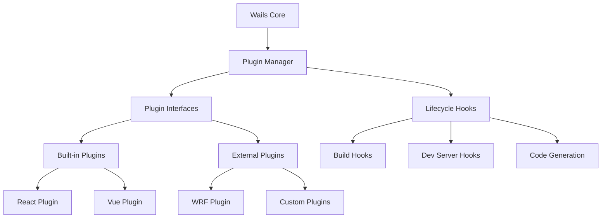

# Task: Documentation and Examples
**Generated from Master Planning**: 2024-01-15
**Context Package**: `/requests/wails-plugin-fork/context/`

## Task Sizing Assessment
**File Count**: 8-10 files
**Estimated Time**: 60 minutes
**Token Estimate**: 80k tokens
**Complexity Level**: 2 (Moderate)
**Parallelization Benefit**: HIGH - Independent documentation
**Atomicity Assessment**: ✅ ATOMIC - Complete documentation package
**Boundary Analysis**: ✅ CLEAR - Documentation files only

## Persona Assignment
**Persona**: Technical Writer
**Expertise Required**: Technical documentation, Go, TypeScript
**Worktree**: `~/work/wrf/wails-plugin-fork/`

## Context Summary
**Risk Level**: LOW - Documentation only
**Integration Points**: All plugin system components
**Architecture Pattern**: Comprehensive developer documentation
**Similar Reference**: Wails documentation style

### Task Scope Boundaries
**MODIFY Zone** (Direct Changes):
```yaml
primary_files:
  - /README.md                              # Fork documentation
  - /docs/plugin-system.md                  # Plugin system overview
  - /docs/plugin-development.md             # Plugin development guide
  - /docs/plugin-api.md                     # API reference
  - /docs/migration-guide.md                # Migration from standard Wails
  - /examples/plugin-react-app/             # Example React app
  - /examples/plugin-wrf-app/               # Example WRF app
  - /examples/custom-plugin/                # Custom plugin example
  - /v2/pkg/plugins/README.md              # Package documentation
  - /PLUGIN_CHANGELOG.md                    # Plugin system changes
```

**REVIEW Zone** (Check for Impact):
```yaml
check_patterns:
  - /CONTRIBUTING.md                        # Update contribution guide
  - /docs/                                  # Existing documentation
```

**IGNORE Zone** (Do Not Touch):
```yaml
ignore_completely:
  - /website/                               # Wails website (separate)
  - /v1/                                    # Legacy version
```

## Task Requirements
**Objective**: Create comprehensive documentation for plugin system suitable for upstream merge

**Success Criteria**:
- [ ] Clear explanation of plugin system architecture
- [ ] Step-by-step plugin development guide
- [ ] API reference with examples
- [ ] Migration guide for existing apps
- [ ] Working example applications
- [ ] Contribution guidelines for plugins

**Validation Commands**:
```bash
# Build documentation
make docs

# Test examples
cd examples/plugin-react-app && npm install && npm run dev
cd examples/plugin-wrf-app && npm install && npm run dev
cd examples/custom-plugin && go build -buildmode=plugin

# Check documentation links
grep -r "](.*)" docs/ | grep -v http
```

## Implementation Details

### 1. Fork README Update (`README.md`)
```markdown
# Wails with Plugin System

This is a fork of [Wails](https://github.com/wailsapp/wails) that adds a comprehensive plugin system for extending build, development, and code generation capabilities.

## 🎯 Fork Purpose

This fork adds a plugin architecture to Wails that enables:
- **Framework Integration**: Enhanced support for React, Vue, and other frameworks
- **Code Generation**: Automatic TypeScript bindings and framework-specific code
- **Development Tools**: Extended dev server capabilities and debugging tools
- **Build Customization**: Hooks into the build process for custom transformations

**Goal**: This fork aims to be merged upstream to benefit the entire Wails community.

## 🚀 Quick Start

### Using Plugins

1. Enable plugins in your `wails.json`:
```json
{
  "plugins": {
    "enabled": true,
    "plugins": {
      "wrf": {
        "enabled": true,
        "config": {
          "generation": {
            "hooks": {
              "output": "frontend/src/hooks/generated"
            }
          }
        }
      }
    }
  }
}
```

2. Run code generation:
```bash
wails plugin generate
```

3. Use generated code in your app:
```typescript
import { useGetUser } from '@/hooks/generated/UserServiceHooks'

function UserProfile({ userId }) {
  const { data: user, loading } = useGetUser(userId)
  // ...
}
```

## 📚 Documentation

- [Plugin System Overview](docs/plugin-system.md)
- [Plugin Development Guide](docs/plugin-development.md)
- [API Reference](docs/plugin-api.md)
- [Migration Guide](docs/migration-guide.md)

## 🔌 Available Plugins

### Built-in Plugins
- **basic-react**: Basic React support with TypeScript bindings
- **basic-vue**: Basic Vue support with TypeScript bindings

### Featured Plugins
- **[WRF](examples/plugin-wrf-app)**: Advanced React framework with React Query integration
- More plugins at [awesome-wails-plugins](https://github.com/wailsapp/awesome-wails-plugins)

## 🤝 Contributing

This fork follows Wails contribution guidelines with additional considerations for the plugin system. See [CONTRIBUTING.md](CONTRIBUTING.md).

### Upstream Merge Plan
- Minimal changes to core Wails
- 100% backward compatibility
- Comprehensive test coverage
- Documentation and examples

## 📄 License

Same MIT license as original Wails project.
```

### 2. Plugin System Overview (`docs/plugin-system.md`)
```markdown
# Wails Plugin System

## Overview

The Wails Plugin System extends Wails with a flexible architecture for build-time and development-time enhancements. Plugins can generate code, modify build processes, extend the development server, and provide framework-specific integrations.

## Architecture



## Core Concepts

### Plugin Types

1. **Code Generators**: Generate TypeScript/JavaScript code from Go
2. **Build Hooks**: Participate in the build process
3. **Dev Server Extensions**: Add middleware and WebSocket handlers
4. **File Watchers**: Monitor files for changes
5. **Template Providers**: Provide project templates

### Plugin Lifecycle

1. **Discovery**: Plugins are discovered from multiple sources
2. **Registration**: Valid plugins are registered with the manager
3. **Initialization**: Plugins are initialized with configuration
4. **Execution**: Plugins participate in various hooks
5. **Shutdown**: Graceful cleanup on termination

## Configuration

Plugins are configured in `wails.json`:

```json
{
  "plugins": {
    "enabled": true,
    "discoveryPaths": ["./plugins", "~/.wails/plugins"],
    "plugins": {
      "plugin-name": {
        "enabled": true,
        "version": "^1.0.0",
        "config": {
          // Plugin-specific configuration
        }
      }
    }
  }
}
```

## Plugin Discovery

Plugins are discovered from:
1. Built-in plugins (compiled into Wails)
2. Project plugins (`.wails/plugins/`)
3. User plugins (`~/.wails/plugins/`)
4. Custom paths (configured in `discoveryPaths`)

## Integration Points

### Build Process
- Pre-build validation
- Code generation
- Asset processing
- Post-build optimization

### Development Server
- HTTP middleware
- WebSocket handlers
- Static file serving
- Hot module replacement

### CLI Commands
- `wails plugin list` - List available plugins
- `wails plugin info <name>` - Show plugin details
- `wails plugin generate` - Run code generation

## Performance Considerations

- Plugins are loaded lazily
- Zero overhead when disabled
- Parallel execution where possible
- Timeout protection for all operations

## Security

- Plugins run with same permissions as Wails
- No sandboxing (plugins are trusted code)
- External plugins require explicit installation
- Configuration validation prevents injection

## Best Practices

1. **Minimal Core Changes**: Plugins should not require Wails modifications
2. **Graceful Degradation**: Handle errors without crashing
3. **Performance**: Minimize overhead, especially in hot paths
4. **Documentation**: Provide clear configuration examples
5. **Testing**: Include comprehensive tests
```

### 3. Plugin Development Guide (`docs/plugin-development.md`)
```markdown
# Plugin Development Guide

## Getting Started

### Basic Plugin Structure

```go
package myplugin

import (
    "context"
    "github.com/wailsapp/wails/v2/pkg/plugins"
)

type MyPlugin struct {
    config *Config
    logger plugins.Logger
}

func NewMyPlugin() plugins.Plugin {
    return &MyPlugin{}
}

// Required: Plugin interface
func (p *MyPlugin) Name() string        { return "my-plugin" }
func (p *MyPlugin) Version() string     { return "1.0.0" }
func (p *MyPlugin) Description() string { return "My custom plugin" }
func (p *MyPlugin) Author() string      { return "Your Name" }

func (p *MyPlugin) Initialize(ctx context.Context, config *plugins.PluginConfig) error {
    p.logger = config.Logger
    // Parse configuration
    return nil
}

func (p *MyPlugin) Shutdown(ctx context.Context) error {
    // Cleanup
    return nil
}

func (p *MyPlugin) Health() error {
    // Health check
    return nil
}
```

### Adding Code Generation

```go
// Implement CodeGenerator interface
func (p *MyPlugin) GenerateCode(ctx *plugins.GenerationContext) ([]*plugins.GeneratedFile, error) {
    // Parse Go source files
    services, err := p.parseServices(ctx.ProjectRoot)
    if err != nil {
        return nil, err
    }
    
    // Generate code
    var files []*plugins.GeneratedFile
    
    for _, service := range services {
        content := p.generateServiceCode(service)
        files = append(files, &plugins.GeneratedFile{
            Path:      fmt.Sprintf("generated/%s.ts", service.Name),
            Content:   []byte(content),
            Mode:      0644,
            Overwrite: true,
        })
    }
    
    return files, nil
}

func (p *MyPlugin) SupportedLanguages() []string {
    return []string{"typescript", "javascript"}
}
```

### Adding Build Hooks

```go
// Implement BuildHook interface
func (p *MyPlugin) PreBuild(ctx *plugins.BuildContext) error {
    p.logger.Info("Pre-build hook", "platform", ctx.Platform)
    
    // Validate project structure
    if err := p.validateProject(ctx.ProjectRoot); err != nil {
        return fmt.Errorf("validation failed: %w", err)
    }
    
    return nil
}

func (p *MyPlugin) PostBuild(ctx *plugins.BuildContext) error {
    p.logger.Info("Post-build hook")
    
    // Process build artifacts
    return p.processBuildArtifacts(ctx.OutputDir)
}
```

### Adding Dev Server Extensions

```go
// Implement DevServerExtension interface
func (p *MyPlugin) ConfigureDevServer(config plugins.DevServerConfigurator) error {
    // Add middleware
    config.AddMiddleware(p.loggingMiddleware())
    
    // Add HTTP handler
    config.AddHandler("/api/plugin", http.HandlerFunc(p.handleAPI))
    
    // Add WebSocket handler
    config.AddWebSocketHandler("/ws/plugin", p)
    
    return nil
}

func (p *MyPlugin) loggingMiddleware() plugins.Middleware {
    return func(next http.Handler) http.Handler {
        return http.HandlerFunc(func(w http.ResponseWriter, r *http.Request) {
            p.logger.Debug("Request", "path", r.URL.Path)
            next.ServeHTTP(w, r)
        })
    }
}
```

## Advanced Topics

### Using Annotations

```go
// Parse custom annotations from Go comments
func (p *MyPlugin) parseAnnotations(comments []*ast.CommentGroup) map[string]string {
    annotations := make(map[string]string)
    
    for _, group := range comments {
        for _, comment := range group.List {
            text := comment.Text
            if strings.HasPrefix(text, "// @myplugin:") {
                // Parse annotation
                parts := strings.SplitN(text[13:], " ", 2)
                if len(parts) == 2 {
                    annotations[parts[0]] = parts[1]
                }
            }
        }
    }
    
    return annotations
}
```

### File Watching

```go
// Implement FileWatcher interface
func (p *MyPlugin) GetWatchPaths(projectRoot string) ([]string, error) {
    return []string{
        filepath.Join(projectRoot, "configs/*.yaml"),
        filepath.Join(projectRoot, "schemas/*.json"),
    }, nil
}

func (p *MyPlugin) OnFileChanged(ctx *plugins.FileChangeContext) error {
    p.logger.Info("File changed", "file", ctx.FilePath)
    
    // Trigger regeneration or other actions
    return nil
}
```

### Testing Your Plugin

```go
func TestMyPlugin_GenerateCode(t *testing.T) {
    plugin := NewMyPlugin()
    
    // Initialize
    config := &plugins.PluginConfig{
        ProjectRoot: t.TempDir(),
        Logger:      testutil.NewTestLogger(),
    }
    
    err := plugin.Initialize(context.Background(), config)
    require.NoError(t, err)
    
    // Test code generation
    ctx := &plugins.GenerationContext{
        Context:     context.Background(),
        ProjectRoot: config.ProjectRoot,
        Logger:      config.Logger,
    }
    
    files, err := plugin.GenerateCode(ctx)
    require.NoError(t, err)
    assert.NotEmpty(t, files)
}
```

## Distribution

### As a Built-in Plugin

1. Add to `/v2/pkg/plugins/builtin/`
2. Register in `builtin.go`
3. Submit PR to Wails

### As an External Plugin

1. Build as plugin:
   ```bash
   go build -buildmode=plugin -o myplugin.so
   ```

2. Install:
   ```bash
   cp myplugin.so ~/.wails/plugins/
   ```

3. Configure in `wails.json`

## Best Practices

1. **Error Handling**: Always return clear, actionable errors
2. **Logging**: Use provided logger, don't print to stdout
3. **Configuration**: Validate configuration in Initialize
4. **Performance**: Cache expensive operations
5. **Compatibility**: Test with multiple Wails versions
```

### 4. Example React App (`examples/plugin-react-app/`)

Create a complete example showing plugin usage:
- `wails.json` with plugin configuration
- Frontend code using generated hooks
- README with setup instructions

### 5. Example WRF App (`examples/plugin-wrf-app/`)

Advanced example with WRF plugin:
- Annotation examples
- React Query integration
- Real-time events
- Dev tools usage

### 6. Migration Guide (`docs/migration-guide.md`)
```markdown
# Migration Guide

## Migrating from Standard Wails

### 1. Update wails.json

Add plugin configuration:
```json
{
  "name": "myapp",
  "plugins": {
    "enabled": true,
    "plugins": {
      "basic-react": {
        "enabled": true,
        "config": {
          "typesOutput": "frontend/src/types/generated.ts",
          "hooksOutput": "frontend/src/hooks/generated"
        }
      }
    }
  }
}
```

### 2. Generate Code

Run initial generation:
```bash
wails plugin generate
```

### 3. Update Imports

Replace manual bindings:
```typescript
// Before
import { GetUser } from '../wailsjs/go/main/App'

// After  
import { useGetUser } from '@/hooks/generated/AppHooks'
```

### 4. Update Components

Use generated hooks:
```typescript
// Before
const [user, setUser] = useState(null)
const [loading, setLoading] = useState(false)

useEffect(() => {
  setLoading(true)
  GetUser(userId).then(data => {
    setUser(data)
    setLoading(false)
  })
}, [userId])

// After
const { data: user, loading } = useGetUser(userId)
```

## Benefits

- Type-safe hooks
- Automatic loading states
- Error handling
- Caching (with React Query)
- Real-time updates
```

## Documentation Standards
- Clear, concise explanations
- Practical examples
- Visual diagrams where helpful
- Consistent formatting
- Version compatibility notes

## Next Steps
With documentation complete, prepare for upstream PR.